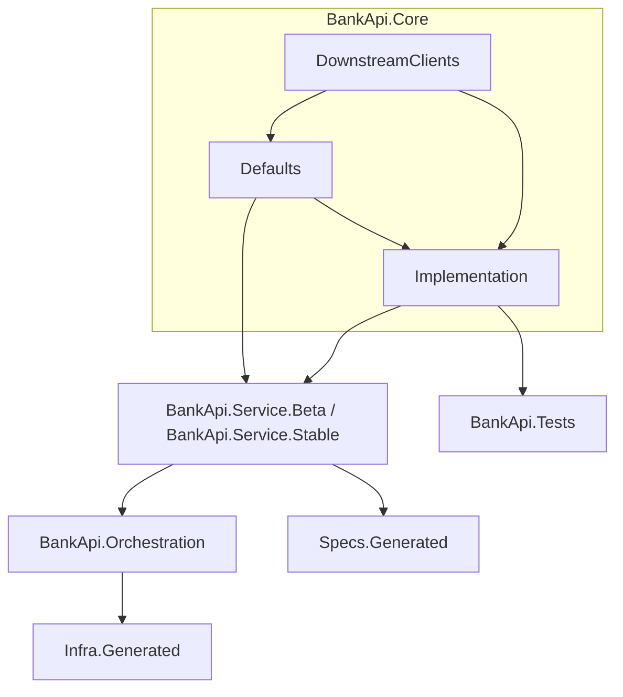

# Bank API 🏦

[![CC BY-NC-SA 4.0][cc-by-nc-sa-shield]][cc-by-nc-sa]


The Bank API is a design reference project suitable to bootstrap development for a compliant and modern API.

For detailed information about the security techniques implemented in this project and how to apply them in your own projects, see the [Security Documentation](SECURITY.md).

## Compliance

The API complies to:

✅ [OWASP API Security Top 10 - v2023](https://owasp.org/API-Security/editions/2023/en/0x11-t10/) via [Spectral OWASP API Security ruleset](https://github.com/stoplightio/spectral-owasp-ruleset?tab=readme-ov-file#spectral-owasp-api-security)

✅ [OpenAPI Specification v3.1.1](https://spec.openapis.org/oas/v3.1.1.html) via [Spectral "oas" ruleset](https://docs.stoplight.io/docs/spectral/4dec24461f3af-open-api-rules)

✅ [Dutch Public Sector (NLGov) REST API Design Rules](https://github.com/Logius-standaarden/API-Design-Rules/) via [API Design Rules ruleset](https://github.com/Logius-standaarden/API-Design-Rules/blob/develop/linter/spectral.yml)

✅ Additional naming conventions, structure, and clarity via [Bank API  project ruleset](.spectral/ruleset.bank.yml)

✅ [California Consumer Privacy Act (CCPA)](https://oag.ca.gov/privacy/ccpa) and [General Data Protection Regulation (GDPR)](https://europa.eu/youreurope/business/dealing-with-customers/data-protection/data-protection-gdpr/index_en.htm#:~:text=The%20GDPR%20sets%20out%20detailed,people%20living%20in%20the%20EU.) via [ASP.Net Core Compliance](https://andrewlock.net/redacting-sensitive-data-with-microsoft-extensions-compliance/)

✅ [RFC 7515 - JSON Web Signature (JWS)](https://datatracker.ietf.org/doc/html/rfc7515) for response signing, via `X-JWS-Signature` header

✅ [RFC 7517 - JSON Web Key Set (JWKs)](https://datatracker.ietf.org/doc/html/rfc7517#appendix-A.1) for validating JWS responses, via `/.well-known/jwks.json` endpoint

## Technology stack

- [ASP.NET Core 10.0 - Minimal API](https://learn.microsoft.com/en-us/aspnet/core/fundamentals/minimal-apis/overview?view=aspnetcore-10.0) for API development, with following base services:

  - [Resilience](https://learn.microsoft.com/en-us/dotnet/core/resilience/http-resilience?tabs=package-reference) for resilience when calling downstream APIs

  - [Compliance](https://andrewlock.net/redacting-sensitive-data-with-microsoft-extensions-compliance/) for redacting sensitive data

  - [Health checks](https://learn.microsoft.com/en-us/aspnet/core/host-and-deploy/health-checks) for checking health status

  - [Service Discovery](https://learn.microsoft.com/en-us/dotnet/core/extensions/service-discovery?tabs=package-reference) for resolving endpoints from config

  - [Hybrid Cache](https://learn.microsoft.com/en-us/aspnet/core/performance/caching/hybrid) for caching

  - [Rate limiting](https://learn.microsoft.com/en-us/aspnet/core/performance/rate-limit) for rate limiting

  - [API Key, JWT bearer and OpenID Connection-based authentication](https://learn.microsoft.com/en-us/aspnet/core/fundamentals/minimal-apis/security#configuring-authentication-strategy) for security, with:
  
    - token reuse prevention for Entra ID tokens

  - [OpenApi](https://learn.microsoft.com/en-us/aspnet/core/fundamentals/openapi/aspnetcore-openapi) for generating OpenAPI specifications

  - [Cross-Origin Resource Sharing (CORS)](https://learn.microsoft.com/en-us/aspnet/core/security/cors) for cross-origin requests

  - [Validation](https://learn.microsoft.com/en-us/aspnet/core/fundamentals/minimal-apis?view=aspnetcore-10.0#enable-built-in-validation-support-for-minimal-apis) for validating requests on endpoints

- [OpenTelemetry (OTel)](https://learn.microsoft.com/en-us/dotnet/core/diagnostics/observability-with-otel) for observability

- [.NET Aspire](https://learn.microsoft.com/en-us/dotnet/aspire/get-started/aspire-overview) for development bootstrapping and client integrations

- [Kiota API client generation](https://learn.microsoft.com/en-us/openapi/kiota/using#client-generation) for calling downstream APIs

- [Gridify](https://alirezanet.github.io/Gridify) for filtering, ordering and paging

- [Scalar](https://learn.microsoft.com/en-us/aspnet/core/fundamentals/openapi/using-openapi-documents#use-scalar-for-interactive-api-documentation) for interactive API documentation

- [Spectral](https://learn.microsoft.com/en-us/aspnet/core/fundamentals/openapi/using-openapi-documents#lint-generated-openapi-documents-with-spectral) for linting

- [TUnit](https://thomhurst.github.io/TUnit/docs/intro) for unit tests

- [REST Client extension](https://marketplace.visualstudio.com/items?itemName=humao.rest-client) in Visual Studio Code for quick local tests via `.http` files

## Design

Technically, the design is layered like the following flowchart.



## Prerequisites

If not using the [Dev Container](.devcontainer/devcontainer.json), install:

- [.NET 10 SDK](https://dotnet.microsoft.com/en-us/download/dotnet/10.0)

- All [recommended Visual Studio Code extensions](.vscode/extensions.json)

## Quick start

- Use a `pwsh` shell (for a click-a-long experience).

- (Optionally) regenerate the GitHub downstream API client by going to the [Kiota workspace](.kiota/workspace.json) and clicking `Re-generate` under `clients`.

  

- (Optionally) regenerate the ASP.NET Core HTTPS development certificate:

  ```powershell
  dotnet dev-certs https --clean && dotnet dev-certs https -ep ./.certs/AspNetDev.pfx -p '' --trust
  ```

- (Optionally) regenerate the Aspire [manifest](https://learn.microsoft.com/en-us/dotnet/aspire/deployment/manifest-format#generate-a-manifest):

  ```powershell
  dotnet run --project BankApi.Orchestration --publisher manifest --output-path ../Infra.Generated/aspire-manifest.json
  ```

- Generate a new JWT-token for secured endpoints:

  ```powershell
  dotnet user-jwts create --scope "bank_api" --role "banker" --valid-for 3650d --project BankApi.Service.Stable
  ```

- Run `dotnet build` to output the OpenAPI definition

- Validate the OpenAPI definition by going to the [openapi_v1.json](/Specs.Generated/openapi_v1.json) definition and check for problems via the Spectral extension.

### Run in Aspire minimal mode

This mode just runs the ASP.NET Core API.

1. Make sure the docker runtime is started.

1. Start the standalone Aspire Dashboard for developer visualization:

    ```powershell
    docker run --rm -it `
      -p 18888:18888 `
      -p 4317:18889 `
      --name aspire-dashboard `
      mcr.microsoft.com/dotnet/aspire-dashboard:latest
    ```

    Copy the url shown in the resulting output when running the container (e.g. <http://localhost:18888/login?t=123456780abcdef123456780>) and open that in a browser, or paste the key part seen after `/login?t=` when the login dialog is shown.
    The token will change each time the container is started.

1. Run the [launch config](.vscode/launch.json) `API - Stable release channel`.

### Run in Aspire mode

This mode starts the [Stable](/BankApi.Service.Stable/) and [Beta](/BankApi.Service.Beta/) versions of the API in context of .NET Aspire.

1. Make sure the docker runtime is started.

1. Run the [launch config](.vscode/launch.json) `Aspire Orchestration`.

## Considerations

### General

1. [OpenID Connect isn't fully supported in Scalar](https://github.com/scalar/scalar/issues/3656).

1. To extend OpenTelemetry logging to Application Insights, [expand the OpenTelemetry exporter](https://learn.microsoft.com/en-us/dotnet/core/diagnostics/observability-applicationinsights).

1. [The compliance NullRedactor doesn't seem to work](https://github.com/dotnet/extensions/issues/5691), the redactor is already defined at [Builder.Compliance.cs](/BankApi.Core/Defaults/Builder.Compliance.cs) but not used because of the issue.

1. Dependabot is enabled for `nuget` packages but [wildcard version notation isn't supported yet](https://github.com/dependabot/dependabot-core/issues/9442#issuecomment-2433046972), which is used extensively in this project.

1. [The OpenAPI document generator shipped with .NET 10 does not fully support API versioning](https://github.com/scalar/scalar/issues/3898#issuecomment-2479087233), a simpler approach with [PathBase](https://andrewlock.net/understanding-pathbase-in-aspnetcore/) is used for now, which is also more convenient for Azure API Management usage.

1. Extending Spectral rulesets from an NPM package [can be problematic](https://github.com/stoplightio/vscode-spectral/issues/214#issuecomment-2543132932).

1. Generic exception handling is minimally implemented via [ErrorHandling.cs](./BankApi.Core/Defaults/Builder.ErrorHandling.cs).

1. API owners usually have customers outside of their own company - or outside of their own domain within a company - which inherently means adoption time will be slower for API contract changes, this is why there is a `Stable` and `Beta` version of the API in this project, inspired by the [Microsoft Graph API Current/Beta versioning design](https://learn.microsoft.com/en-us/graph/versioning-and-support#versions). New or modified contract-breaking (beta) operations to API consumers may be served via the `Beta` version without distracting users on the `Stable` version.

    Do not confuse this versioning scheme as a replacement for [DTAP](https://en.wikipedia.org/wiki/Development,_testing,_acceptance_and_production); it is merely complementary to it. Many API changes will affect both the `Stable` and `Beta` endpoints (such as changes to the underlying shared database). That's why they both share a common layer in the form of `BankApi.Core`.

    Nonetheless, versioning is very opinionated and one should always see what the best business and technical fit is. This might change over time and from project to project.

1. Dev Containers with the `docker-outside-of-docker` feature instead of `docker-in-docker` [do not work](https://github.com/dotnet/aspire/issues/6830), for now we're using `docker-in-docker`.

Please see the Reddit r/dotnet [post 1](https://www.reddit.com/r/dotnet/comments/1gyql5a/bank_api_modern_api_reference_project/?utm_source=share&utm_medium=web3x&utm_name=web3xcss&utm_term=1&utm_content=share_button) and [post 2](https://www.reddit.com/r/dotnet/comments/1hji970/bank_api_modern_api_reference_now_complies_to/?utm_source=share&utm_medium=web3x&utm_name=web3xcss&utm_term=1&utm_content=share_button) about this project for more considerations and information.

## Troubleshooting

- If debugging isn't working properly, please clear the Extension Host Cache at `%AppData%\Code\CachedData` (on Windows) and restart VSCode.

- If getting the error [`unable to get local issuer certificate` with Spectral](https://github.com/stoplightio/vscode-spectral/issues/131#issuecomment-2543187287), make sure to add the CA of the proxy to `NODE_EXTRA_CA_CERTS` and restart VSCode, for example:

```powershell
[Environment]::SetEnvironmentVariable('NODE_EXTRA_CA_CERTS', 'C:\ZscalerRootCA.crt', 'User')
```

- [Extending Rulesets with local filepath not refreshing](https://github.com/stoplightio/vscode-spectral/issues/266) when working on Spectral rulesets in VSCode. Force an update in the [.spectral/main.yml](.spectral/main.yml) when changing a file that is used as an extend.

## License

This work is licensed under a
[Creative Commons Attribution-NonCommercial-ShareAlike 4.0 International License][cc-by-nc-sa].

[![CC BY-NC-SA 4.0][cc-by-nc-sa-image]][cc-by-nc-sa]

[cc-by-nc-sa]: http://creativecommons.org/licenses/by-nc-sa/4.0/
[cc-by-nc-sa-image]: https://licensebuttons.net/l/by-nc-sa/4.0/88x31.png
[cc-by-nc-sa-shield]: https://img.shields.io/badge/License-CC%20BY--NC--SA%204.0-lightgrey.svg
